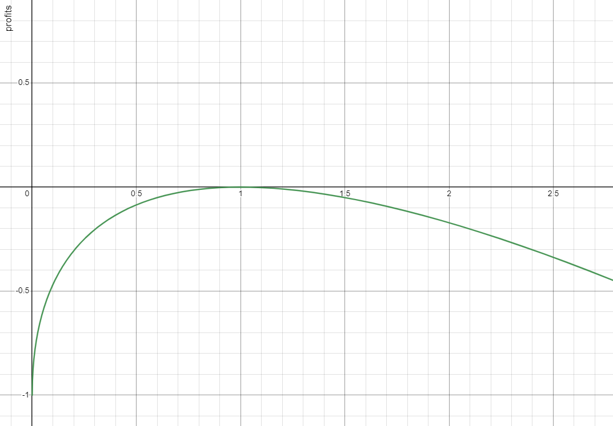

Bebracoin(BBR) is a collaterised rebase stablecoin backed by quasi delta-neutral strategies on Optimism chain.

## Key feautures

1. It is a rebase stablecoin which is a type of cryptocurrency that adjusts its total supply and token balances in all wallets based on total amount in strategies. The goal of the rebase mechanism is to simplify rewards accruing process for any token held by each wallet.
2. It is backed by different strategies(currently 2 quasi delta-neutral). During some time claiming functions can be triggered and rewards would be accrued, total supply would be increased and every BBR holder would recieve its reward in the form of extra BBR.
3. The protocol could be runned by anyone(no need for owner interactions), the calculations for rebalancing and claiming all done on-chain, anyone could trigger the rebalancing and claiming process if the required conditions are met.

## Quasi delta-neutral strategies

This strategies involves depositing liquidity into lending supply and volatile liquidity pool(volatile asset/stable asset), then hedging this position by borrowing volatile asset from lending market.

### Strategy mechanics

In order to maintain delta-neutrality, we should maintain level of 100% hedging percentage so the amount of borrowed asset in dollar value would be the half of amount of liquidity in pool.

In standart pools with constant product formula, the liquidity position $L$ depending on price in pool $p$ changed like so:

$$
d L=\sqrt{d p}
$$

where $d l=\frac{L_2}{L_1}, d p=\frac{p_2}{p_1}$
so the actual pool profit:

$$
P_p = L_1\left(\sqrt{\frac{p_1}{p_2}}-1\right)
$$

howewer, hedging liquidity is changing lineary to the price change

$$
d L_h=-d p
$$

hedging liquidity profit:

$$
P_h=-L_1\left(\frac{p_1}{p_2}-1\right)
$$

Thus, our all profits depending from price change:

$$
P=2(\sqrt{d p}-1)-d p+1
$$



This equation shows us that strategy perform the best, when it is fully hedged. In that case if price didn’t change this curve would just rise up by earning rewards.

During the strategy performing, it might be that price of the volatile asset could significaly change, to prevent impermanent loss and possible liquidation on lending protocol we should implement strategy rebalancing mechanism and outline strategy parameters when the mechanism needed to be triggered. The hard task is to understand when to rebalance.

### Liquidity distribution

$C F$ - Collateral factor, $I$ - our investment in $ , $h p$ - hedging percentage, $h f$ - health factor $(h f>1)$, $b$ - borrow amount in $, $s$ - supply amount in $, $L P$ - amount in the liquidity pool in $.

We surely know how to calculate health factor:

$$
h f=\frac{s}{b} * C F
$$

Assuming $100 \%$ hedging percentage when $\mathrm{hp}=1$ and borrow amount is the half of the LP amount:

$$
h p=\frac{2 b}{L P}
$$

Investment, is the same after opening position and before:

$$
I=s-b+L P
$$

Aftre doing some math stuff, the ultimate equations is following

$$
\begin{aligned}
& L P=\frac{I}{1-\frac{h p}{2}\left[1-\frac{h f}{C F}\right]} \\
& b=\frac{h p * I}{2-h p\left[1-\frac{h f}{C F}\right]} \\
& s=\frac{h p * h f}{2 C F}\left[\frac{I}{1-\frac{h p}{2}\left(1-\frac{h f}{C F}\right)}\right]
\end{aligned}
$$

If we assume $100 \%$ hedging $(h p=1)$, which is required for delta-neutrality, formulas becomes much simplier:

$$\begin{aligned} & L P=\frac{2 I}{1+\frac{h f}{C F}} \\ & b=\frac{I}{1+\frac{h f}{C F}} \\ & s=\frac{h f * b}{C F}\end{aligned}$$

### Initial funds allocation example

Consider an investment of 1000$ to the velodrome/Sonne WETH/USDC instrument, collateral factor is 0.9, health factor 1.2 with a safe margin of 0.2 from liquidations.

Using equations from above:

$LP$ = 857.1 $

$b$ = 428.57 $

$s$ = 571.5 $

Ultimately, in order to get into position, funds flow would be following:

1. Supply 571.5 $ worth of USDC to the Sonne
2. Borrow 428.57 $ worth of WETH from Sonne
3. Deposit 428.57 $ worth of WETH and 428.5 $ worth of USDC in to the Velodrome liquidity pool

### Rebalancing mechanics

Assume that we successfuly got into position from previous examples

Than, for rebalancing it could be two cases:

1. WETH/USDC price growth
2. WETH/USDC price fall

Rebalance is triggered whenever health factor reaches specified threshold either up or down.

Actions to reabalance:

1. Calculate total amount: current supply in $ - current borrow in $ + current LP in $
2. Using this total amount as Investment, calculate target borrow, supply using eqaitions above
3. Calculate deltas: db = target borrow - current borrow , ds = target supply - current supply
4. Unstake LP token from gauge and withdraw LP funds from pool
   After calculating deltas, there is four cases:
   - ds>0 and db>0 rebalance actions: supply ds, borrow db
   - ds>0 and db<0 rebalance actions: supply ds, repay db
   - ds<0 and db<0 rebalance actions: withdraw ds, repay db
   - ds<0 and db>0 rebalance actions: withdraw ds, borrow db
5. Swap all excess liquidity in target price proportion and deposit into liquidity pool(in most cases swap will not require high swap amount, because funds would already be in close proportion)
6. Deposit LP token to gauge

Pros and Cons of Rebalancing

Cons:

Impermanent Loss(IL) is materialized. Rebalancing will cause some losses if the price returns to the initial level, but non-rebalancing will not, and it will bear more losses when the price continues to fluctuate.

Pros:

Avoid long or short position exposure immediately, and if the price of non-stable asset keeps dump or pump, no losses would be generated from such exposures;
No liquidation risk, the maximum loss is limited even in the case of severe price pumping or dumping.

The first number that we should check is the health factor(hf) it has relation with hedging percentage, so by maintaining hf, we maintain hedging percentage. The minimumn threshold is restricted by liquidation at 1. The maximum is not restricted.

## Leveraged delta-neutral strategies

coming soon

## Smart-contracts breakdown

1. BebraCoin.sol
2. StrategyManager.sol
3. PositionManager.sol

## Current status

Because of all the calculations done on-chain operation gas costs for this protocol is too high just to operate for my funds even in Optimism chain.

Strategies breakdown:

1. Velodrome/Sonne WETH/USDC
2. Velodrome/Sonne OP/USDC

### Run tests:

```shell
npx hardhat test
```
